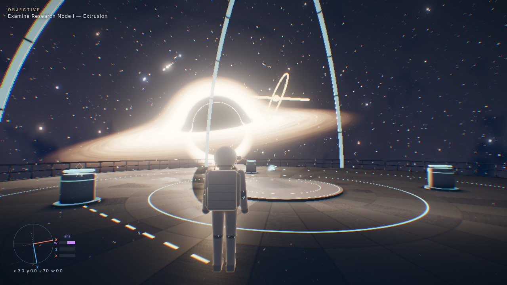
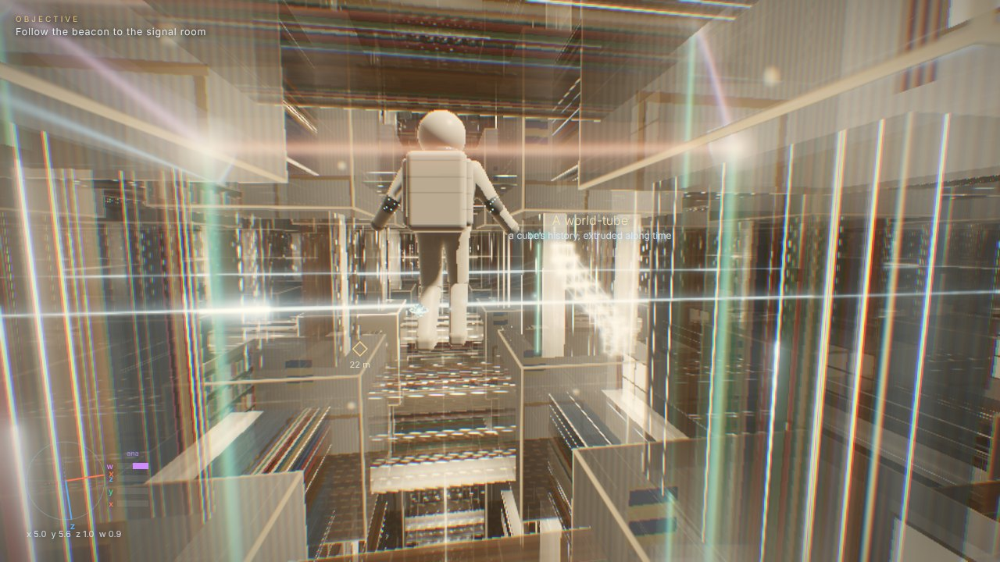
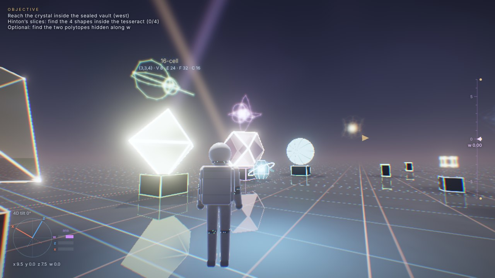
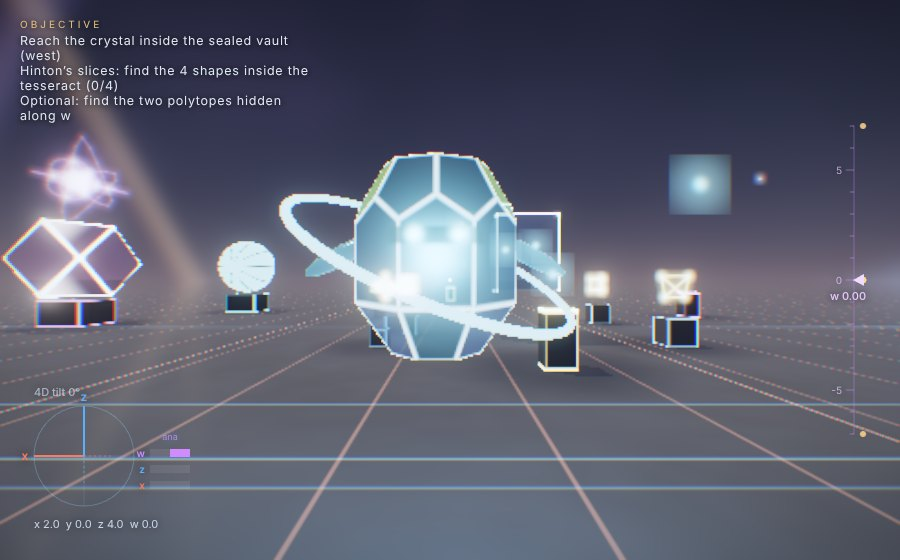

# Hyperspace Walk

**A scientifically grounded walk through four-dimensional space — in a single HTML file.**

Open [`hyperspace-walk.html`](hyperspace-walk.html) in a current desktop or mobile browser (Chrome, Edge, Firefox, Safari with WebGL 2). No install, no server, no external assets: every image, sound and voice line is computed live.

| | |
|---|---|
|  |  |
|  |  |

*Screenshots are software-rendered previews at reduced resolution; a GPU renders considerably sharper.*

You explore ℝ⁴ with **Aether**, a crystalline companion who explains each idea by voice (English or Bulgarian, through your device's speech synthesiser) and with interactive holograms:

| Chapter | What happens | What is computed |
|---|---|---|
| **I · Euclid Station** | A deck orbiting a Gargantua-class black hole. Three research nodes teach extrusion (point → tesseract, and its unfolding net), slicing (Flatland, the hypersphere, vertex-first tesseract slices) and projection & rotation (orthographic / perspective / stereographic; simple, double and isoclinic rotations). | Signed-distance architecture lit by the lensed disk; the sky is traced through Schwarzschild null geodesics per pixel. |
| **II · The Plunge** | Fly a pod along a plunge trajectory through holographic guide rings, eject, cross the horizon, and fall through nested "holes within holes". | Geodesic ray tracing with relativistic aberration for an infalling observer; real time-dilation, redshift and tidal readouts. The interior is labelled as a dramatization. |
| **III · The Tesseract** | An *Interstellar*-inspired lattice of rooms and slit-scan world-lines. Move along w and the channels dissolve, leaving the rooms; send a binary message through the dust by plucking world-lines; watch the tesseract close by rotating in 4D. | An exact 3D slice of a 4D lattice: 4D voxel traversal and analytic clipping of every bar, translucent compositing, 4D collisions. |
| **IV · The Bulk** | Open 4D space with gravity. Turn into the fourth dimension, find the six regular 4-polytopes (two are hidden along w), escape-proof vault puzzle solved by going *around* walls through w, and Hinton's tesseract-slice puzzle. | Cyrus–Beck clipping of each pixel's 4D line against polytope half-spaces, 4D shadows and reflections, 1/r³ sound falloff, a live slice classifier. |

Every explanation is stored in the **Research Log** with equations (LaTeX rendered to MathML) and primary references; holograms can be re-projected from it. See [`docs/MATHEMATICAL_MODELS.md`](docs/MATHEMATICAL_MODELS.md) for the full description of each model and its sources.

## Controls

| Keyboard / mouse | Gamepad | Touch | Action |
|---|---|---|---|
| WASD, mouse | sticks | left stick zone, drag right side | move, look |
| Space / C / Shift | A / B / L3 | ↑ / ↓ / RUN | jump-up / crouch-down / run |
| Q / E | LB / RB | w− / w+ | move along −w / +w (kata / ana) |
| hold R + mouse, Z / X | LT / RT | 4D toggle + drag | rotate into the fourth dimension |
| T | D-pad ↓ | ⟲w | snap 4D orientation back to the axes |
| F | X | F | interact |
| H / J / N / Y, hold K | Y | ◎ / +? | Aether: repeat / tell me more / skip / pause, voice command |
| V, B | D-pad ↑ | ◐ | camera 1st/3rd person, free-fly 4D camera (later chapters) |
| L or Tab, Esc | Back, Start | LOG, ≡ | research log, pause |

## Settings and accessibility

Quality presets with dynamic resolution, field of view, physical Doppler beaming (off = the film's look), bloom/grain/aberration/flare, volumes, voice choice and rate, subtitles (size, background), colour-vision assist (protan/deutan/tritan daltonisation), reduced motion, reduced flashing, look sensitivity and inversion, and English/Bulgarian. Progress, settings and unlocked log entries are saved in the browser.

## Scope note

The original brief describes an Unreal Engine 5 / Blender production. This repository implements the design as a real-time **WebGL 2** experience in one self-contained file, so it runs anywhere without a download: the photoreal targets are approached with ray-traced 4D slicing, geodesic lensing, HDR bloom and filmic tone mapping rather than offline-rendered assets, and the characters are ray-marched signed-distance figures rather than MetaHumans.

*Inspired by* Interstellar *(2014) and Kip Thorne's* The Science of Interstellar. *No material from the film is used.*
