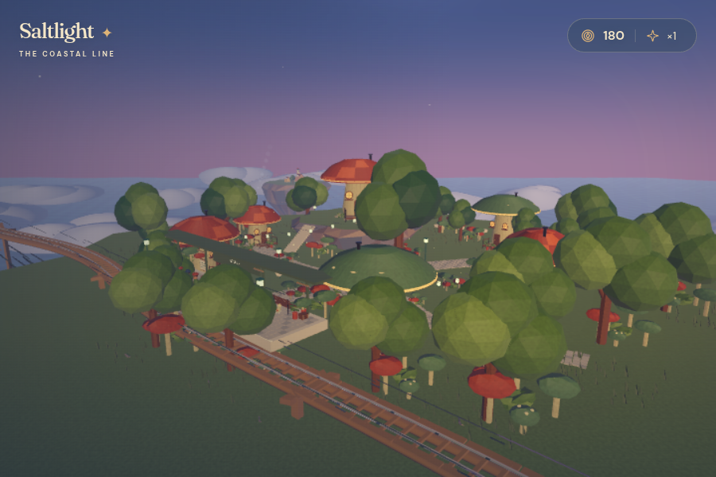
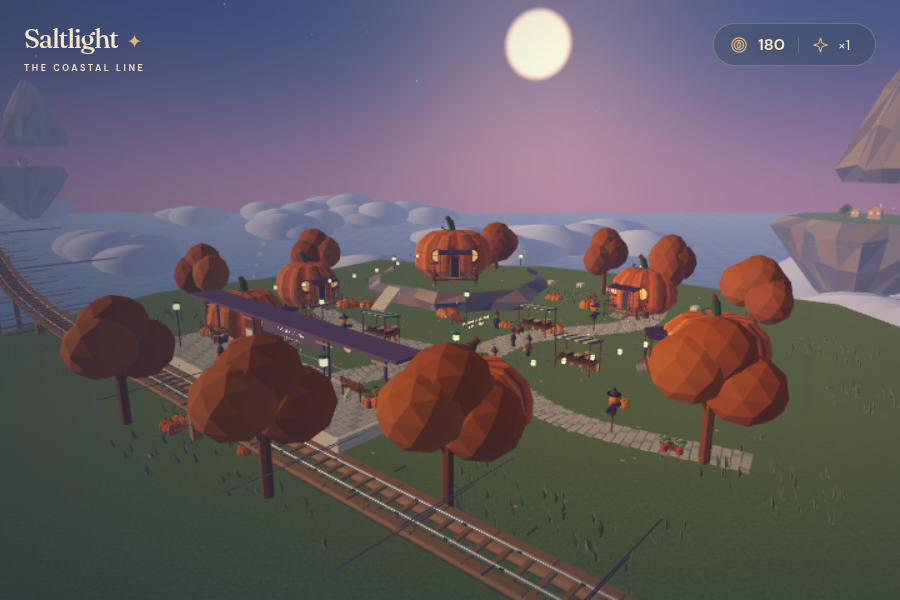
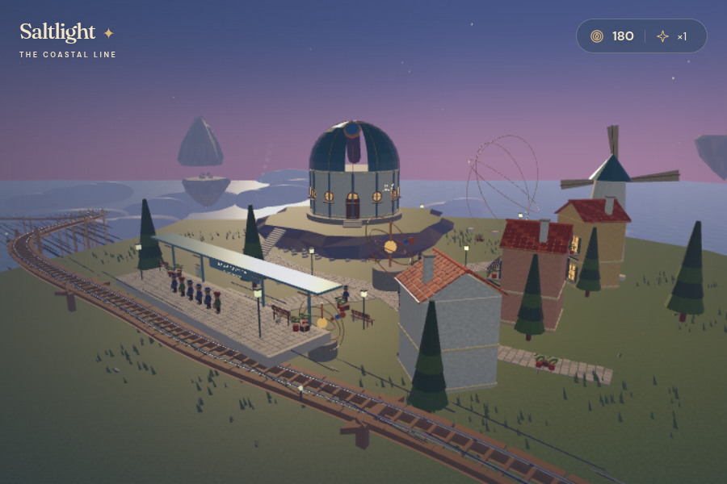

# Saltlight · The Coastal Line

An original, playable 3D browser game about an evening tram run through **five floating worlds**. The 37 original model assets are made in **Blender 4.3** and the game is built in **Godot 4.6**, using its WebGL 2 Compatibility renderer. A responsive HTML/CSS/JavaScript shell provides the browser HUD, soundscape and field journal.

## Play

**[Play Saltlight in your browser](https://rawcdn.githack.com/Loriens22/Main/0c8374375f59fed1d42a9881a774aa2ad99b9323/web/index.html)**

On a first visit, the host displays an external-content notice. Choose **Open the page**, then **All aboard**. The published build has been checked in a browser with real keyboard and touch input.

Choose **All aboard**, then hold **W** for power and **S** to brake. Release to coast. Arrow keys also accelerate, brake, and look around. **C** changes between chase, window, scenic and driver's cameras; the fourth camera becomes a village panorama at a platform. **Space** opens doors and departs after boarding. **R** visits Oliver's Cloudworks while stopped at a station. **J** opens the Coastal Field Journal. **P / Esc** pauses. On mobile, hold the Power and Brake buttons.

The continuous railway climbs, descends and curves around a circuit longer than 1.5 km:

| Station | Its little world | Your neighbour |
| --- | --- | --- |
| Saltlight Terminus | Lighthouse quarter, narrow stone streets, balconies, café tables and evening post | Ada, the postmistress |
| Mango Tide | Hanging harbour, fruit market, date palms, skiffs and a turning windmill | Luca, the fruit seller |
| Fernbell | Mushroom homes with freckled caps, timber porches, glowing gills, fern gardens and fireflies | Mira, the spore keeper |
| Lantern Hollow | Ribbed pumpkin cottages, cheerful jack lanterns, a harvest fair, copper-leaved trees and festival hats | Pip, the lantern maker |
| Tideglass Observatory | Copper telescope, celestial gardens, a monumental armillary sphere and a waterfall into clouds | Iris, the astronomer |

Every arrival collects a station stamp. Complete the **five-stamp album for 100 coins**, then keep driving the endless line. The journal's **Take a look** buttons show live animated views of each village while preserving and pausing your journey. Passenger dialogue gives every stop its own story.

Ease off for raised curves, downhill sections, and crosswinds. A smooth arrival earns **75 coins**; a rough one earns **35**. Rough driving can break your tip streak, and a stretch of balanced driving rebuilds it. A station safety brake prevents missed platforms. Each platform boards its own group of passengers.

The expanded scenery includes irregular cliff ledges and retaining walls, individually paved winding lanes, meadow edges, furnished platforms, clocks and timetables, rooftop chimneys, rigged viaducts, a postal airship, wandering residents, platform cats, smoke, waterfalls and fireflies. The tram has brass rivets, suspension coils, rotating wheels, coupling rings, leather hand loops, driver gauges, clear cabin glass, seated and standing neighbours, and luggage straps. Surface grain, separate metal materials, warm dusk lighting and lower follow cameras keep details readable at passenger scale.

The workshop fits **Hearth leaves** (50 coins: green roof and ivy) and **Little Companion** (75 coins: luggage rack, lanterns and softer suspension). Fittings are animated in an isometric workshop and visibly change your tram. Fares, fitted parts and journal stamps are saved locally in your browser, including existing saves from the original game. Sound starts after your first interaction; the sound button mutes the original procedural score, wheel joints, wind and bells.

Scenery detail defaults to **Automatic**. The pause menu also offers **High** with full shadows and **Balanced** for a smoother ride. Repeated geometry is instanced by neighbourhood and keeps its imported levels of detail.

## Open the source

- `blender/saltlight_assets.blend` — editable original low-poly asset library.
- `blender/build_assets.py` — deterministic, commented asset generator and glTF exporter.
- `blender/archipelago_assets.py` — original mushroom, pumpkin, observatory, market, resident and mechanical detail models.
- `godot/project.godot` — open this project in Godot 4.6.3 or later.
- `godot/scripts/world.gd` — Catmull–Rom/Bezier circuit, continuous rails and viaducts, five themed villages, neighbourhood instancing, procedural materials and ambient animation.
- `godot/scripts/game.gd` — inertial acceleration and braking, corner roll, crosswinds, comfort, boarding, rewards, upgrades and follow cameras.
- `web/` — checked-in browser build, responsive HUD, field journal and audio. The game assets and fonts are bundled.

## A few stops along the way





### Rebuild

Install Blender 4.3+, Godot 4.6.3 and its matching export templates, then run from the repository root:

```sh
blender -b -t 2 --python blender/build_assets.py
godot --headless --path godot --editor --import --quit
godot --headless --path godot --script res://tests/simulation_check.gd
godot --headless --path godot --export-release Web ../web/index.html
python3 -m http.server 8000 --directory web
```

Visit `http://localhost:8000`. Browser security requires serving the WebAssembly game over HTTP(S), so opening `index.html` as a `file://` URL will not work. The export is single-threaded and works on GitHub Pages without cross-origin isolation headers.

The game lives on the `saltlight-coastal-line` branch of `Loriens22/Main`. The connected GitHub integration cannot enable GitHub Pages, so the play link serves the published GitHub build through the githack CDN. The link is pinned to the tested game commit.

Re-export after changing Godot source or Blender assets, publish the updated browser build to this branch, and update the CDN link to the new commit. To use GitHub Pages instead, the repository owner can select **Settings → Pages → Deploy from a branch → saltlight-coastal-line → / (root)**.

## Credits

All 3D models, game code and procedural music were created for Saltlight. Fraunces and DM Sans are bundled under their SIL Open Font Licenses (`web/fonts/`). Godot is MIT-licensed; Blender is GPL-licensed. No Studio Ghibli or Nintendo assets are used.

The game requires a recent browser with WebGL 2 enabled. The automated simulation check verifies clear cabin glazing, completes the entire five-stop circuit and verifies continuity, comfort, single-award fares, local boarding counts, album completion, both visible upgrades, workshop return, pause and live previews. Keyboard controls, touch input and journal interactions are also checked in a browser.
